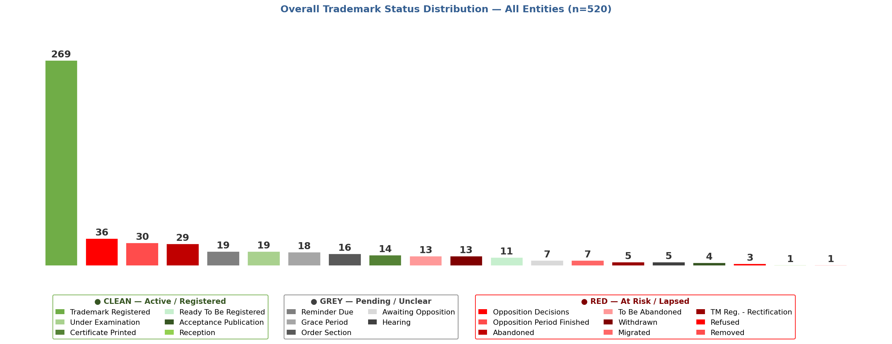
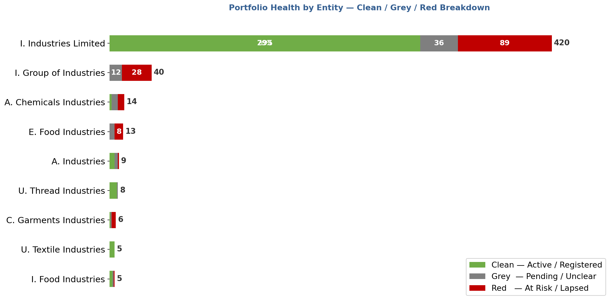
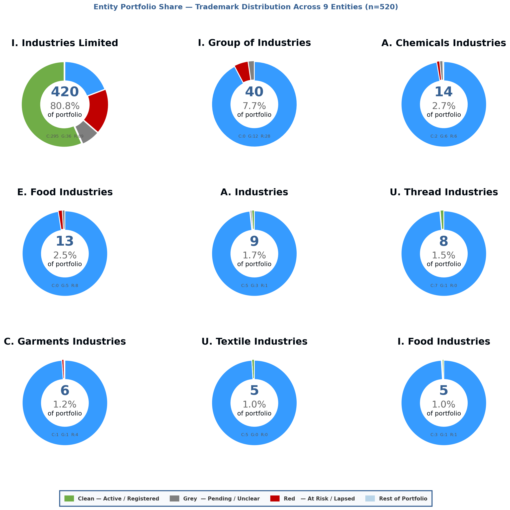
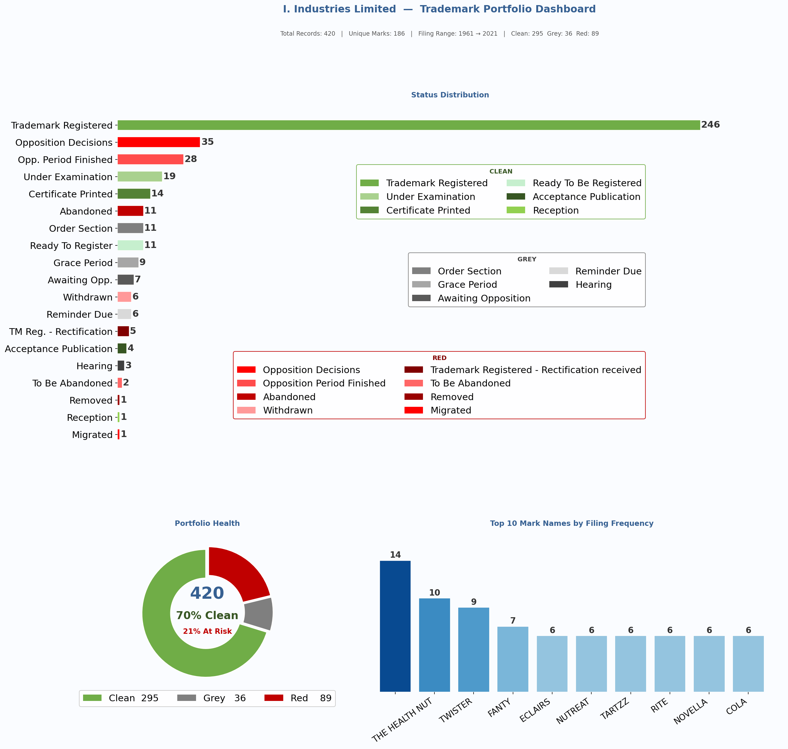

# Brand IP Analytics Pipeline

> **Automated trademark portfolio intelligence built on real Pakistani IP Office data.**
> Replacing a decade of manual, session-by-session legal tracking with a reproducible 4-stage Python pipeline.

---

## The Problem

Intellectual property management in Pakistan relies on PDF exports from the IP Office registry — dense, inconsistently formatted documents with no structured data layer. For a portfolio spanning multiple business entities, decades of filings, and hundreds of trademarks, tracking portfolio health meant manually opening PDFs, reading status updates, and maintaining fragmented records session by session.

This project automates that entire workflow:

- **556 raw records** extracted from IP Office PDFs in a single pipeline run
- **33 inconsistent status strings** normalised into 20 clean canonical values
- **9 business entities** identified, disambiguated, and separated from 36 false matches
- **12 visualisations** generated automatically — from portfolio overview to individual entity dashboards

The result: what previously required hours of manual cross-referencing now runs end-to-end in minutes.

---

## What This Pipeline Does

The pipeline processes raw IP Office PDF exports through four automated stages:

```
PDF Exports (Pakistani IP Office)
        │
        ▼
┌─────────────────────────┐
│  Stage 1 — Extraction   │  pdfplumber parses table structures
│  Two parser versions    │  across multi-page, multi-file PDFs
└────────────┬────────────┘
             │
             ▼
┌─────────────────────────┐
│  Stage 2 — Normalisation│  Regex disambiguates 9 entity name
│  & Cleaning             │  variants; 33 status strings → 20
└────────────┬────────────┘  canonical values; false matches dropped
             │
             ▼
┌─────────────────────────┐
│  Stage 3 — Excel Export │  Multi-sheet formatted workbook:
│  (openpyxl)             │  one sheet per entity + Master sheet
└────────────┬────────────┘  + Unique Mark Names cross-analysis
             │
             ▼
┌─────────────────────────┐
│  Stage 4 — Visualisation│  12 charts: status distribution,
│  (matplotlib)           │  portfolio health, donut grid,
└─────────────────────────┘  per-entity dashboards
```

---

## Dataset (Anonymised)

All entity names have been anonymised using initial abbreviations to protect client confidentiality. Numbers, findings, and pipeline logic are real.

| Attribute | Value |
|-----------|-------|
| Source | Pakistani Intellectual Property Office PDF exports |
| Raw records extracted | 556 |
| False matches dropped | 36 |
| Clean records retained | 520 |
| Business entities | 9 |
| Filing range | 1961 → 2021 · 60 years of trademark history |
| Unique mark names | 285 |
| Raw status variants | 33 |
| Canonical status values | 20 |

### Entity Breakdown

| Entity | Records | Share |
|--------|---------|-------|
| I. Industries Limited | 420 | 80.8% |
| I. Group of Industries | 40 | 7.7% |
| A. Chemicals Industries | 14 | 2.7% |
| E. Food Industries | 13 | 2.5% |
| A. Industries | 9 | 1.7% |
| U. Thread Industries | 8 | 1.5% |
| C. Garments Industries | 6 | 1.2% |
| U. Textile Industries | 5 | 1.0% |
| I. Food Industries | 5 | 1.0% |

### Portfolio Health Summary

| Scale | Count | % |
|-------|-------|---|
| 🟢 Clean — Active / Registered | 302 | 58.1% |
| ⚫ Grey — Pending / Unclear | 91 | 17.5% |
| 🔴 Red — At Risk / Lapsed | 127 | 24.4% |

---

## Pipeline Architecture

### Stage 1 — PDF Extraction

The IP Office exports tables across multi-page PDFs with inconsistent formatting. Two parser versions were developed iteratively:

**Version 1 — File Number Detection**
Detects new trademark records by identifying non-empty `File No.` column values. Handles continuation rows by appending text to the current record.

**Version 2 — `1/T` Anchor Parser** *(production version)*
More robust for the Pakistani filing format. Anchors new record detection to the `1/T` file number prefix. Fixes applied:
- `sorted(os.listdir())` for reproducible file ordering
- IndexError guard on continuation rows: `range(len(current_record))` with `i < len(row)` boundary check
- `df.map()` replacing deprecated `applymap` (pandas 2.x compatibility)

### Stage 2 — Normalisation & Cleaning

The raw registry data contains significant inconsistencies — entity names appear in dozens of formats (case variations, `Trading As` prefixes, `M/s.` abbreviations, registry typos), and status strings are frequently truncated or abbreviated. Nine regex normalisation blocks standardise entity names across all variations. 33 raw status strings are reduced to 20 canonical values via ordered `startswith()` pattern matching.

A 5-record minimum threshold removes 36 false matches — registry search results that share a name fragment with client entities but represent unrelated businesses. This decision is documented in `docs/pipeline_architecture.md`.

### Stage 3 — Excel Export

Multi-sheet formatted workbook (`openpyxl`):
- `Master_All_Data` — all 520 records with `Source_Sheet` column
- One sheet per entity (9 sheets) — summary block, status breakdown, detailed data
- `Unique Mark Names` — cross-entity mark name frequency analysis
- Professional colour scheme: `#366092` headers, `#70AD47` status headers, `#FFC000` section titles

### Stage 4 — Visualisation

12 charts across 4 types, all saved to `charts/`:

| Chart | Type | Description |
|-------|------|-------------|
| 01 | Bar chart | Overall status distribution — all 520 records |
| 02 | Stacked horizontal bar | Portfolio health — Clean/Grey/Red per entity |
| 03 | 3×3 Donut grid | Entity portfolio share of total 520 records |
| 04–12 | Entity dashboards | Per-entity: status barh + health donut + top marks bar |

---

## Key Findings

**Dominant entity:** I. Industries Limited holds 420 of 520 records (80.8% of the portfolio) with a 70% Clean health score — the strongest position in the group.

**At-risk concentration:** 24.4% of the total portfolio is classified Red (at risk or lapsed). This is concentrated in I. Group of Industries (42.5% Red) and E. Food Industries (61.5% Red) — both warrant immediate legal review.

**Filing history:** The portfolio spans 60 years (1961–2021), with the dominant entity showing continuous filing activity. Smaller entities cluster in narrow windows (2002–2009) suggesting discrete registration campaigns rather than ongoing IP management.

**False match rate:** 36 of 556 raw records (6.5%) were false matches — individuals sharing a personal name fragment with the client entity's registered name, returned by the registry search.

**Status normalisation complexity:** 33 raw status variants reduced to 20 canonical values. The registry's inconsistent truncation of status strings (e.g. `Opposition (period) finishe`) required careful `startswith()` ordering to prevent partial-match shadowing.

---

## Charts

### Portfolio Overview

**Chart 01 — Overall Status Distribution**
All 520 records across 20 normalised status categories, coloured by Clean/Grey/Red scale.



---

**Chart 02 — Portfolio Health by Entity**
Stacked horizontal bar showing Clean/Grey/Red breakdown for each of the 9 entities.



---

**Chart 03 — Entity Portfolio Share**
3×3 donut grid — each entity's share of the total 520-record portfolio with health annotations.



---

### Entity Dashboards

Individual dashboards for each entity — status distribution, portfolio health donut, and top mark names by filing frequency. View all 9 in the interactive HTML report.

**I. Industries Limited (420 records)**


> 📊 **[View Full Interactive HTML Report](report/trademark_portfolio_report.html)**
>
> The HTML report embeds all 12 charts and includes a navigable entity summary table, pipeline architecture overview, and methodology notes. Self-contained — no dependencies, opens in any browser.

---

## Tech Stack

```
Language    Python 3.10
Extraction  pdfplumber
Processing  pandas 2.x · numpy
Export      openpyxl
Charts      matplotlib
Environment Jupyter Notebook · Windows
```

**Key libraries:**

| Library | Purpose |
|---------|---------|
| `pdfplumber` | Table extraction from IP Office PDF exports |
| `pandas` | DataFrame operations, groupby, normalisation |
| `re` | Regex-based entity name and status disambiguation |
| `openpyxl` | Multi-sheet Excel workbook creation and formatting |
| `matplotlib` | Bar charts, stacked bars, donut grids, dashboards |
| `base64` | Chart embedding in self-contained HTML report |

---

## Confidentiality Note

**What is in this repository:**
- `README.md` — this document
- `charts/` — all 12 generated PNG chart files
- `report/trademark_portfolio_report.html` — self-contained interactive HTML report
- `.gitignore` — excludes all data and notebook files
- `docs/pipeline_architecture.md` — extended technical documentation

**What is not in this repository:**
- The extraction and analysis notebook (`.ipynb`) — withheld. This pipeline represents 10 years of domain-specific IP analytics knowledge built for a real client. The methodology is described in full; the implementation is proprietary.
- Raw data files (`.csv`, `.xlsx`) — withheld. Client confidentiality.
- Source PDF files — withheld. Pakistani IP Office exports contain client-identifiable information.

**Entity names** have been anonymised using initial abbreviations (e.g. `I. Industries Limited`) while preserving industry sector context. All record counts, status distributions, and findings are real.

---

## Repository Structure

```
trademark-intelligence-pipeline/
│
├── README.md
├── .gitignore
│
├── charts/
│   ├── 01_overall_status_distribution.png
│   ├── 02_entity_portfolio_health.png
│   ├── 03_entity_donut_grid.png
│   ├── 04_dashboard_i._industries_limited.png
│   ├── 05_dashboard_i._group_of_industries.png
│   ├── 06_dashboard_a._chemicals_industries.png
│   ├── 07_dashboard_e._food_industries.png
│   ├── 08_dashboard_a._industries.png
│   ├── 09_dashboard_u._thread_industries.png
│   ├── 10_dashboard_c._garments_industries.png
│   ├── 11_dashboard_u._textile_industries.png
│   └── 12_dashboard_i._food_industries.png
│
├── report/
│   └── trademark_portfolio_report.html
│
└── docs/
    └── pipeline_architecture.md
```

---

*Mehmood Ahmed Khan — Data Scientist & Analytics Engineer*
*github.com/Mehmoodkhans · linkedin.com/in/mehmoood*
